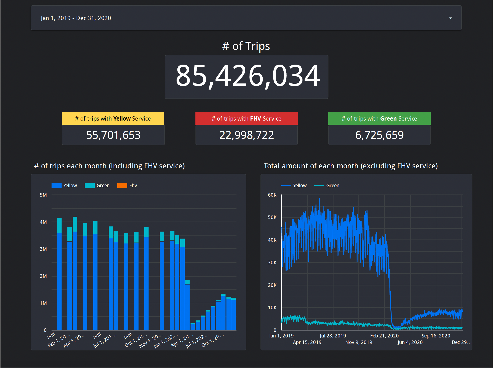
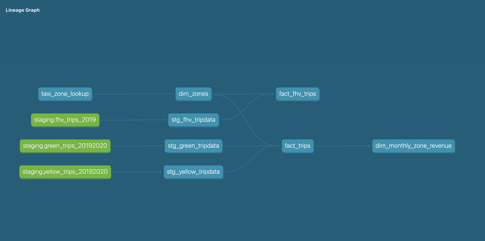

# 04-analytics-engineering
dbt Core + BigQuery + Looker Studio

# Dashboard
The viz can be seen [here](https://lookerstudio.google.com/s/hkkeSK_kOdM)

# Lineage
This is generated by `dbt docs generate && dbt docs serve`

# Packages
Generated by using `uv pip freeze > requirements.txt`. UV is a extremely fast package installed and resolver written in Rust that claimed to be 10-100x faster than `pip` and `pip-tools`.
Install it with `pip install -r requirements.txt` or `uv pip install -r requirements.txt`